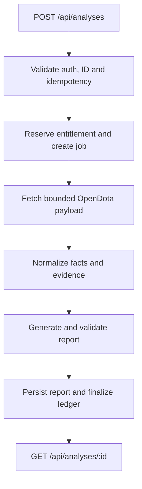

# NARMA VISION: recovery architecture

Status: accepted implementation baseline for the closed beta.

This document replaces the unrecoverable local-only release candidate mentioned
in the shared ChatGPT conversation. The GitHub repository ends at `f941f86`; no
later commit or hidden object is present in the available clone.

## Outcome of this milestone

The product has two deliberately different entry paths:

- **NARMA Scan** is the acquisition loop approved in the shared product work. It
  may run before sign-in, returns one deterministic evidence-backed moment, never
  spends an entitlement and never sends player names, account IDs or chat to a
  model. It has its own durable abuse/rate-limit gate.
- **Full analysis** belongs to an authenticated account, may use a model, persists
  history and questions, and is the only path that can reserve an entitlement.

This local milestone implements:

1. a feature-gated, two-step anonymous Scan route and UI;
2. bounded fixed-origin OpenDota fetching, strict normalization and deterministic
   evidence/preview generation;
3. D1 schemas for source cache, jobs, reports, rate limits, billing evidence and
   immutable entitlement accounting;
4. a server-only OpenAI Responses adapter with strict output, reference and
   numeric-claim checks;
5. fail-closed runtime/payment gates, CI and release verification.

It does **not** yet implement the authenticated full-analysis routes, job runner,
history, questions, refund/reconciliation workflow or model-backed UI. Those
remain the next delivery slices and all related flags stay off.

The existing match `8963624400` remains a public golden demo and regression
fixture. It is not presented as proof that arbitrary-match processing is already
available.

## Deliberate release boundaries

- New checkout is disabled by default. `PAYMENTS_ENABLED` controls only creation
  of new payments; webhook settlement uses a separate switch so an emergency
  sales stop never drops settlement for payments already created.
- Analysis fulfillment is disabled until the job lifecycle, atomic entitlement
  ledger and recovery tests all pass against D1 under Workerd.
- Production deploy, GitHub push, live YooKassa credentials and advertising are
  outside this local recovery milestone.
- Amazon RDS is not introduced. D1 is sufficient for the closed beta; a move to
  Postgres requires measured contention, storage or query-limit evidence.
- OpenDota parse requests are not issued automatically in the first slice. A
  parse request costs ten OpenDota rate-limit calls and needs its own persisted,
  single-flight state before it can be enabled safely.
- Player chat and other untrusted free text are excluded from model instructions.

## Target full-analysis flow

This diagram is the target state, not a claim that the routes or worker are
already wired:

Every transition is conditional on the current state and a lease token. A retry
may repeat any step, but it must not duplicate a report, consume a second credit,
or overwrite a terminal state.

## Versioned contracts

### `NormalizedMatchV1`

Contains only validated game facts used by the product: Match ID, patch/parser
metadata when present, duration, winner, game mode, ten players, team totals,
objective events, fights and sampled economy. Nullable OpenDota fields remain
nullable instead of being guessed.

### `EvidenceBundleV1`

Each evidence item has a stable ID, a factual `kind`, an exact time or time
window, an optional player slot, numeric values with units, and a short
deterministic summary. The bundle is canonically serialized and SHA-256 hashed.

### `AnalysisReportV1`

Model-authored items are limited to `inference` and `advice`; raw facts stay in
the evidence bundle. Every item includes existing `evidenceIds`, a confidence
level, limitations and at least one structured numeric `claim`. A claim contains
only `evidenceId`, `metric`, `value` and `unit`. Unknown fields are rejected.
After JSON-schema validation the server verifies references, timestamps, player
slots, `evidenceHash`, and an exact metric/value/unit match inside the cited
evidence item.

Numeric characters are rejected in titles, bodies and limitations, including
Unicode numeric characters. A conservative lexical guard also rejects common
Russian and English number words, multiplicative/fraction/percentage terms,
quantitative comparisons and mathematical symbols. Natural language has
unbounded paraphrases, and a conservative token list can also reject benign
quantitative-adjacent wording. The guard is therefore defense in depth rather
than a semantic proof. Product UI must treat prose as qualitative advice and
render every quantitative fact only from validated claims.

OpenAI integration uses the Responses API with Structured Outputs. Refusal,
incomplete output, invalid JSON, unknown evidence IDs or changed evidence hashes
fail closed; they are never shown as a completed report.

These checks prove schema, reference and numeric-value integrity, but an exact
claim match alone does not prove that the cited fact is relevant to the model's
qualitative inference or causal advice. Those remain model-authored judgments,
so confidence and limitations must stay visible. Full fulfillment remains a
no-go until the job, ownership, entitlement and recovery gates below are
implemented and exercised.

The required `claims` field revises the pre-launch `analysis-report.v1` contract
in place only because authenticated full-analysis routes and persisted reports
are not live. If any environment already contains report payloads under this
version, release must use a new schema version plus an explicit migration or
compatibility reader instead.

## API contract

| Route | Status | Result |
|---|---|---|
| `POST /api/scan` | Implemented, flag off | `{matchId}` returns `choose_player` with 10 safe roster rows; adding `playerSlot` returns one deterministic preview; no model or entitlement |
| `POST /api/analyses` | Planned | Create or replay an idempotent job for `{matchId, playerSlot}` |
| `GET /api/analyses` | Planned | Cursor-paginated history owned by the current user |
| `GET /api/analyses/:id` | Planned | Owned job status and completed report |
| `POST /api/analyses/:id/questions` | Planned | Grounded follow-up after report completion |

Public errors use one envelope: `{ error: { code, message, retryable, requestId } }`.

Anonymous Scan accepts only same-origin `application/json` requests up to 4 KiB.
Its two success shapes are deliberately narrow:

- `choose_player`: `{ status, match: { matchId, durationSeconds }, players }`,
  where every one of the ten players contains only slot, hero, side and nullable
  K/D/A;
- `ready`: `{ status, preview }`, where `preview` is exactly one
  `ScanPreviewV1` selected from deterministic evidence.

The route trusts only Cloudflare's `CF-Connecting-IP` for abuse control. The
address is never stored: an HMAC-SHA-256 digest includes the fixed-window start,
so buckets cannot be correlated across windows. Expired buckets must be deleted
by a scheduled D1 retention job before enabling Scan outside a closed beta; the
cleanup job is an explicit release gate, not request-path best effort.

| HTTP | Meaning |
|---|---|
| 400 | Invalid request or Match ID |
| 401 | Missing user session |
| 402 | No analysis/question entitlement |
| 404 | Owned resource or OpenDota match not found |
| 409 | Idempotency key was reused with another request body |
| 413 | Request or upstream payload exceeds the bound |
| 429 | Product rate limit; response includes `Retry-After` |
| 503 | OpenDota, OpenAI, queue or storage is temporarily unavailable |

Provider-side `401`, `402` and configuration failures are mapped to product
`503`, never to a user authentication or balance error.

## Durable data model

The migrations currently create:

- `source_matches`: unique `(match_id, normalizer_version)`, source status,
  canonical normalized payload, hash and timestamps.
- `analysis_jobs`: user, Match ID, player slot, report version, state, attempt,
  lease, typed failure, timestamps and idempotency request hash.
- `analysis_reports`: one immutable versioned payload per completed job, evidence
  hash, model/prompt metadata and creation time.
- `entitlement_ledger`: immutable grants, reservations, consumption and release;
  balances are derived or transactionally maintained projections.
- `provider_events`, physical `orders` and `refunds`: payment evidence separated
  from entitlement fulfillment; refund execution is not implemented.
- `rate_limit_buckets`: durable fixed-window counters with hashed identities.

`coach_threads` and `coach_messages` are planned with ownership, report links and
grounded question/answer payloads; they do not exist in the current migrations.

Financial records are retained and detached from a soft-deleted user; they are
never removed through a cascading account deletion.

## Runtime configuration

All feature flags default to `false` when absent or malformed.

| Variable | Purpose |
|---|---|
| `SCAN_RUNTIME_ENABLED` | Accept bounded anonymous Scan requests |
| `SCAN_RATE_LIMIT_SECRET` | 32+ character server-only HMAC key for window-bound anonymous counters |
| `DB` | D1 binding required by the Scan cache and atomic rate limiter |
| `ANALYSIS_RUNTIME_ENABLED` | Accept new analysis jobs |
| `ANALYSIS_FULFILLMENT_ENABLED` | Consume entitlements and run fulfillment |
| `OPENAI_API_KEY` | Server-only model credential |
| `OPENAI_MODEL` | Allowlisted model identifier |
| `PAYMENTS_ENABLED` | Create new checkout sessions |
| `PAYMENT_SETTLEMENT_ENABLED` | Verify and settle existing provider events |
| `PAYMENT_MODE` | Explicit `test` or `live`; stored on every order |

Test and live payments use different databases and credentials. The provider's
`test` field must match the stored order mode before settlement.

## Release gates

A closed-beta build is a no-go until all of the following pass:

- lint, TypeScript, production build and the full Node test suite;
- OpenDota timeout, oversized body, malformed data, 404, 429 and 5xx tests;
- anonymous Scan abuse limits, privacy projection and no-model contract tests;
- concurrent Scan limiter verification under Workerd/D1 plus scheduled expiry
  cleanup before enabling the flag beyond isolated staging;
- strict report validation plus adversarial prompt-injection, numeric-prose and
  mismatched metric/value/unit claim tests;
- idempotency, parallel reservation, duplicate delivery and expired-lease tests;
- ownership/IDOR tests for report, history and questions;
- D1 migration and API integration tests under Workerd/Miniflare;
- keyboard-only modal flow, focus return and 375/768/1440 visual checks;
- negative staging test proving direct clients cannot forge identity headers;
- recovery and reconciliation runbooks exercised in test mode.

Live payments remain a separate no-go until legal seller details, offer,
privacy/consent, receipts, refunds, test-mode reconciliation and kill-switch
procedures have been reviewed by the owner.
